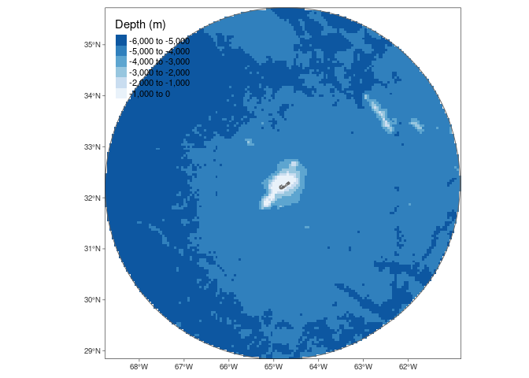
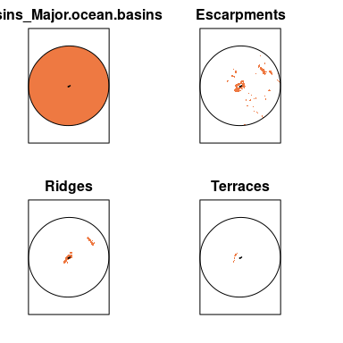
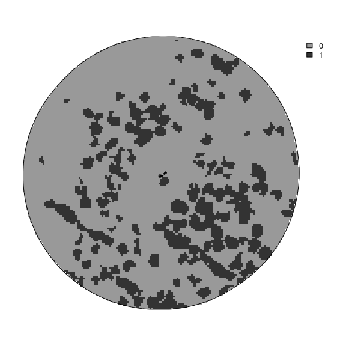
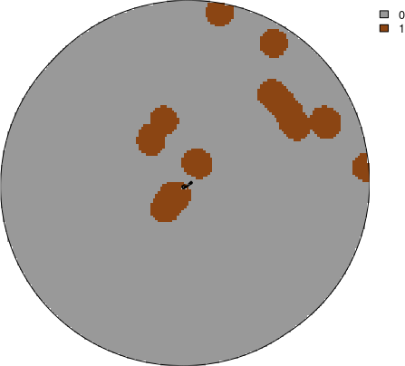
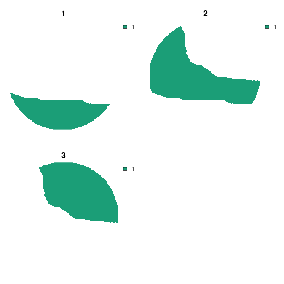

<!-- README.md is generated from README.Rmd. Please edit that file -->

# oceandatr

<!-- badges: start -->
<!-- badges: end -->

`oceandatr` aims to provide simple functions for creating data for
conducting a spatial conservation prioritization for large scale areas
of the ocean, specifically offshore areas.

## Installation

You can install the development version of oceandatr from
[GitHub](https://github.com/) with:

``` r
if (!require(devtools)) install.packages("devtools")
devtools::install_github("emlab-ucsb/oceandatr")
```

## Example of usage

``` r
#load oceandatr package
library(oceandatr)
```

### Obtain an EEZ for an area of interest

This function pulls data for EEZs from the [Marine
Gazetteer](https://marineregions.org/gazetteer.php) using the
`mregions2` R package; the function is just a wrapper to make the
process a bit simpler.

``` r
bermuda_eez <- get_area(area_name = "Bermuda")

#plot to check we have Bermuda's EEZ
plot(bermuda_eez[1], col = "lightblue", main=NULL, axes=TRUE)
```


# Choose a CRS

Best practice is to use a local, equal area projection for all
geospatial data for use in the prioritization. Finding a suitable
projection can be tricky, but [projection
wizard](https://projectionwizard.org) provides a handy tool. Standard
projections used for countries can also be found at <https://epsg.io/>
by searching with country name.

The bounding box coordinates for the area of interest can be used to
generate the coordinate reference system (CRS) on [projection
wizard](https://projectionwizard.org)

``` r
sf::st_bbox(bermuda_eez)
#>      xmin      ymin      xmax      ymax 
#> -68.91706  28.90577 -60.70480  35.80855
```

The coordinates above should be entered as the ‘Geographic extent’ and
the map should then have a box drawn around the bounding box of the area
of interest. The projection can then be copied and pasted from the
pop-up box when clicking on ‘WKT’ or ‘PROJ’. For brevity, we are using
the PROJ string, but WKT is now [generally
preferred](https://inbo.github.io/tutorials/tutorials/spatial_crs_coding/).
The projection needs to be placed in quotation marks as follows:

``` r
projection_bermuda <- '+proj=laea +lon_0=-64.8108333 +lat_0=32.3571917 +datum=WGS84 +units=m +no_defs'
```

### Get a planning grid for the area of interest

A planning grid is needed for spatial prioritization. This divides the
area of interest into grid cells. The `planning_grid` function will
return a planning grid for the specified area of interest (polygon),
projected into the coordinate reference system specified, at the cell
resolution specified in kilometres.

``` r
planning_grid <- get_planning_grid(area_polygon = bermuda_eez, projection_crs = projection_bermuda, resolution = 5000)

#project the eez into same projection as planning grid for plotting
bermuda_eez_projected <- bermuda_eez %>% 
  sf::st_transform(crs = projection_bermuda) %>% 
  sf::st_geometry()

#plot the planning grid
terra::plot(planning_grid, col = "gold3", axes = FALSE, legend = FALSE)
plot(bermuda_eez_projected, add=TRUE)
```


The raster covers Bermuda’s EEZ. The grid cells would be too small to
see if we plotted them, but here is a coarser grid (lower resolution)
visualized so we can see what the grid cells look like.

``` r
planning_grid_coarse <- get_planning_grid(area_polygon = bermuda_eez, projection_crs = projection_bermuda, resolution = 20000)

plot(bermuda_eez_projected, axes = FALSE)
terra::plot(terra::as.polygons(planning_grid_coarse, dissolve = FALSE), add=TRUE)
```


### Get bathymetry

Now we have our planning grid, we can get data for this area of
interest. A key piece of data is bathymetry. If the user has downloaded
data for the area of interest from the [GEBCO
website](https://www.gebco.net), they can pass the file path to this
function and it will crop and rasterize the data using the supplied
planning grid. If no file path is provided, the function will extract
bathymetry data for the area from the [ETOPO 2022 Global Relief
model](https://www.ncei.noaa.gov/products/etopo-global-relief-model)
using a function borrowed from the `marmap` package.

``` r
bathymetry <- get_bathymetry(planning_grid = planning_grid, classify_bathymetry = FALSE)
#> This may take seconds to minutes, depending on grid size

terra::plot(bathymetry, col = hcl.colors(n=255, "Blues"), axes = FALSE) 
plot(bermuda_eez_projected, add=TRUE)
```



### Depth classification

The ocean can be classified into 5 depth zones:

- 0 - 200m: Epipelagic zone
- 200 - 1000m: Mesopelagic zone
- 1000 - 4000m: Bathypelagic zone
- 4000 - 6000m: Abyssopelagic zone
- 6000m+: Hadopelagic zone

We can get the depth zones for Bermuda simply by setting the
`classify_bathymetry` argument in `get_bathymetry` to `TRUE`.

``` r
depth_zones <- get_bathymetry(planning_grid = planning_grid, classify_bathymetry = TRUE)
#> This may take seconds to minutes, depending on grid size

terra::plot(depth_zones, col = "navyblue", axes = FALSE, legend = FALSE, fun = function(){terra::lines(terra::vect(bermuda_eez_projected))})
```


### Get geomorphological data

The seafloor has its own mountains, plains and other geomorphological
features just as on land. These data come from [Harris et al. 2014,
Geomorphology of the
Oceans](https://doi.org/10.1016/j.margeo.2014.01.011) and are available
for download from <https://www.bluehabitats.org>. The features that are
suggested as major habitats for inclusion in no-take MPAs by [Ceccarelli
et al. 2021](https://doi.org/10.3389/fmars.2021.634574) are included in
this package, so it is not necessary to download them.

``` r
geomorphology <- get_geomorphology(planning_grid = planning_grid)

terra::plot(geomorphology, col = "sienna2", axes = FALSE, legend = FALSE, fun = function(){terra::lines(terra::vect(bermuda_eez_projected))})
```



## Get knolls data

Knolls are another geomorphological feature, which are ‘small’
seamounts, classified as seamounts between 200 and 1000m higher than the
surrounding seafloor [Morato et
al. 2008](https://doi.org/10.3354/meps07268). Data are the knoll base
area data from [Yesson et
al. 2011](https://doi.org/10.1016/j.dsr.2011.02.004).

``` r
knolls <- get_knolls(planning_grid = planning_grid)

terra::plot(knolls, col = "grey40", axes = FALSE, legend = FALSE)
plot(bermuda_eez_projected, add=TRUE)
```



## Get seamount areas

Seamounts, classified as peaks at least 1000m higher than the
surrounding seafloor [Morato et
al. 2008](https://doi.org/10.3354/meps07268). These data are from
[Yesson et al. 2021](https://doi.org/10.14324/111.444/ucloe.000030).
Each peak is buffered to the distance specified in the function call.
The units of the buffer are in the same units as the area polygon or
planning grid, which can be checked using,
e.g. `sf::st_crs(planning_grid, parameters = TRUE)$units_gdal`

``` r
#planning grid units are metres, so set buffer to 30000 m = 30 km
seamounts <- get_seamounts_buffered(planning_grid = planning_grid, buffer = 30000)

terra::plot(seamounts, col = "saddlebrown", axes = FALSE, legend = FALSE)
plot(bermuda_eez_projected, add=TRUE)
```



## Habitat suitability models

Retrieve habitat suitability data for 3 deep water coral groups:

- Antipatharia: Habitats associated with increased biodiversity in both
  invertebrate and vertebrate species; global distributions were modeled
  by [Yesson et al. (2017)](https://doi.org/10.1016/j.dsr2.2015.12.004)
- Cold water coral: Important habitats and nursery areas for many
  species; global distributions were modeled by [Davies and Guinotte
  (2011)](https://doi.org/10.1371/journal.pone.0018483)
- Octocoral: Important habitats for invertebrates, groundfish, rockfish
  and other species; global distributions were modeled by [Yesson et
  al. (2012)](https://doi.org/10.1111/j.1365-2699.2011.02681.x)

``` r
coral_habitat <- get_coral_habitat(planning_grid = planning_grid)

#show the seamounts areas on the plot: coral habitat is often on seamounts which are shallower than surrounding ocean floor
plot_add <- function(){
  terra::lines(terra::vect(bermuda_eez_projected), col = "grey40")
  terra::lines(terra::as.polygons(seamounts, dissolve = TRUE), col = "orangered4")
  }

terra::plot(coral_habitat, col = "coral", axes = FALSE, fun = plot_add)
```


## Environmental Regions

Bioregions are often included in spatial planning, but available
bioregional classifications are either too coarse or too detailed to be
useful for planning at the EEZ level. Borrowing methods from [Magris et
al. 2020](https://doi.org/10.1111/ddi.13183)

``` r
#cluster the data
#set number of clusters to 3 to reduce runtime and memory usage
enviro_regions <- get_enviro_regions(planning_grid = planning_grid, num_clusters = 3)
```


``` r
#plot
terra::plot(enviro_regions, col = "forestgreen", axes = FALSE, legend =FALSE, fun = function(){terra::lines(terra::vect(bermuda_eez_projected))})
```


