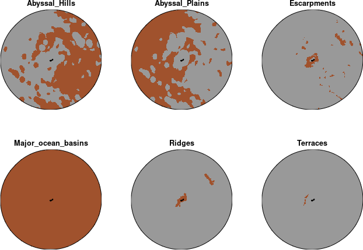
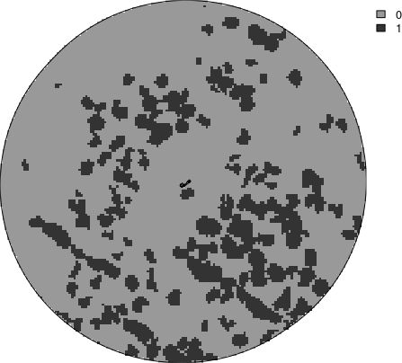
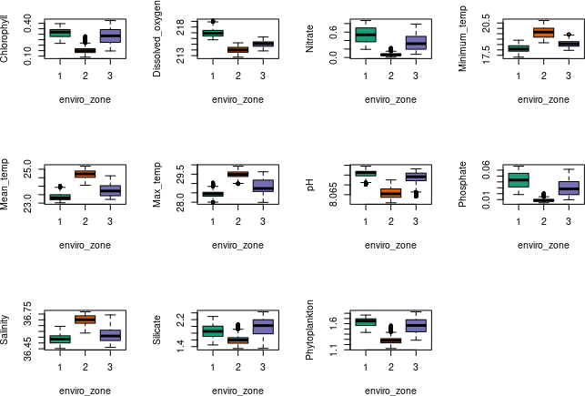

<!-- README.md is generated from README.Rmd. Please edit that file -->

# oceandatr <a href="https://emlab-ucsb.github.io/oceandatr/"></a>

<!-- badges: start -->
<!-- badges: end -->

`oceandatr` aims to provide simple functions for retrieving ocean data.
Using the associated package `spatialgridr`, it can also easily grid
data, which is useful for various purposes including spatial
conservation prioritization.

Fish images in logo modified from original by Tracey Saxby, [Integration
and Application Network](https://ian.umces.edu/media-library)

## Installation

You can install oceandatr from [GitHub](https://github.com/) with:

``` r
if (!require(remotes)) install.packages("remotes")
#might need to increase timeout as it is a large package
options(timeout = 9999)
remotes::install_github("emlab-ucsb/oceandatr")
```

# Getting gridded ocean data

``` r
#load oceandatr package
library(oceandatr)
```

### Obtain an EEZ for an area of interest

First we need a boundary for the area we are interested in. We can use
the `get_boundary()` function, imported from `spatialgridr`, to get a
boundary for land or ocean. In this example we will get Bermuda’s
Exclusive Economic Zone (EEZ)

``` r
bermuda_eez <- get_boundary(name = "Bermuda")

#plot to check we have Bermuda's EEZ
plot(bermuda_eez[1], col = "lightblue", main=NULL, axes=TRUE)
```


## Get a grid

We are going to get gridded data. To create a grid for Bermuda, we use
`get_grid()`. We need to provide a suitable projection for the area we
are interested in, <https://projectionwizard.org> is useful for this
purpose. Standard projections used for countries can also be found at
<https://epsg.io/> by searching with country name. For spatial planning,
equal area projections are normally best.

The bounding box coordinates for the area of interest can be found using
`sf::st_bbox(bermuda_eez)` and these can then be used to generate the
coordinate reference system (CRS) on [projection
wizard](https://projectionwizard.org)

The coordinates above should be entered as the ‘Geographic extent’ and
the map should then have a box drawn around the bounding box of the area
of interest. The projection can then be copied and pasted from the
pop-up box when clicking on ‘WKT’ or ‘PROJ’. For brevity, we are using
the PROJ string, but WKT is now [generally
preferred](https://inbo.github.io/tutorials/tutorials/spatial_crs_coding/).
The projection needs to be placed in quotation marks as follows:

``` r
projection_bermuda <- '+proj=laea +lon_0=-64.8108333 +lat_0=32.3571917 +datum=WGS84 +units=m +no_defs'
```

We can now create a grid for Bermuda’s EEZ using `get_grid()`. Along
with the projection we found above, we will need to set a resolution:
how wide and high will each grid cell be, in this case in metres. The
units will depend on your crs and can be found using
e.g. `sf::st_crs(projection_bermuda, parameters = TRUE)$units_gdal`

``` r
bermuda_grid <- get_grid(boundary = bermuda_eez, resolution = 5000, crs = projection_bermuda)

#project the eez into same projection as grid for plotting
bermuda_eez_projected <- bermuda_eez %>% 
  sf::st_transform(crs = projection_bermuda) %>% 
  sf::st_geometry()

#plot the grid
terra::plot(bermuda_grid, col = "gold3", axes = FALSE, legend = FALSE)
plot(bermuda_eez_projected, add=TRUE)
```


The raster covers Bermuda’s EEZ. The grid cells would be too small to
see if we plotted them, but here is a coarser grid (lower resolution)
visualized so we can see what the grid cells look like.

``` r
bermuda_grid_coarse <- get_grid(boundary = bermuda_eez, resolution = 20000, crs = projection_bermuda)

plot(bermuda_eez_projected, axes = FALSE)
terra::plot(terra::as.polygons(bermuda_grid_coarse, dissolve = FALSE), add=TRUE)
```


## Get bathymetry

Now we have a grid, we can get some data. A key piece of data is
bathymetry. If the user has bathymetry data for their area of interest
already, they can pass the file path to this function and it will grid
the data using the supplied spatial grid. If no file path is provided,
the function will extract bathymetry data for the area from the [ETOPO
2022 Global Relief
model](https://www.ncei.noaa.gov/products/etopo-global-relief-model)
using a function borrowed from the
[`marmap`](https://cran.r-project.org/web/packages/marmap/index.html)
package.

``` r
bathymetry <- get_bathymetry(spatial_grid = bermuda_grid, classify_bathymetry = FALSE)
#> This may take seconds to minutes, depending on grid size

terra::plot(bathymetry, col = hcl.colors(n=255, "Blues"), axes = FALSE) 
plot(bermuda_eez_projected, add=TRUE)
```


### Depth classification

The ocean can be classified into 5 depth zones:

- 0 - 200m: Epipelagic zone
- 200 - 1000m: Mesopelagic zone
- 1000 - 4000m: Bathypelagic zone
- 4000 - 6000m: Abyssopelagic zone
- 6000m+: Hadopelagic zone

We can get the depth zones for Bermuda simply by setting the
`classify_bathymetry` argument in `get_bathymetry` to `TRUE`.

``` r
depth_zones <- get_bathymetry(spatial_grid = bermuda_grid, classify_bathymetry = TRUE)
#> This may take seconds to minutes, depending on grid size

#value of 1 indicates that depth zone is present
terra::plot(depth_zones, col = c("grey60", "navyblue"), axes = FALSE, fun = function(){terra::lines(terra::vect(bermuda_eez_projected))})
```


## Get geomorphological data

The seafloor has its own valleys, plains and other geomorphological
features just as on land. These data come from [Harris et al. 2014,
Geomorphology of the
Oceans](https://doi.org/10.1016/j.margeo.2014.01.011) and are available
for download from <https://www.bluehabitats.org>, but all but depth
classifications (which can be created using `get_bathymetry()`) and
seamounts (which can be retrieved from a more recent dataset using
`get_seamounts()`) are included in this package.

``` r
geomorphology <- get_geomorphology(spatial_grid = bermuda_grid) %>% 
  remove_empty_layers() #can remove any empty layers so we don't have so many layers to plot

#brown colour indicates that geomorphological feature is present
terra::plot(geomorphology, col = data.frame(c(0,1), c("grey60", "sienna")), axes = FALSE, legend = FALSE, fun = function(){terra::lines(terra::vect(bermuda_eez_projected))})
```



## Get knolls data

Knolls are another geomorphological feature, which are ‘small’
seamounts, classified as seamounts between 200 and 1000m higher than the
surrounding seafloor [Morato et
al. 2008](https://doi.org/10.3354/meps07268). Data are the knoll base
area data from [Yesson et
al. 2011](https://doi.org/10.1016/j.dsr.2011.02.004).

``` r
knolls <- get_knolls(spatial_grid = bermuda_grid)

#value of 1 indicates that knolls are present
terra::plot(knolls, col = c("grey60", "grey20"), axes = FALSE)
plot(bermuda_eez_projected, add=TRUE)
```



## Get seamount areas

Seamounts, classified as peaks at least 1000m higher than the
surrounding seafloor [Morato et
al. 2008](https://doi.org/10.3354/meps07268). These data are from
[Yesson et al. 2021](https://doi.org/10.14324/111.444/ucloe.000030).
Each peak is buffered to the distance specified in the function call.
The units of the buffer are in the same units as the spatial grid, which
can be checked using,
e.g. `sf::st_crs(bermuda_grid, parameters = TRUE)$units_gdal`

``` r
#spatial grid units are metres, so set buffer to 30000 m = 30 km
seamounts <- get_seamounts(spatial_grid = bermuda_grid, buffer = 30000)

#value of 1 indicates that seamount is present
terra::plot(seamounts, col = c( "grey60", "saddlebrown"), axes = FALSE)
plot(bermuda_eez_projected, add=TRUE)
```


## Habitat suitability models

Retrieve habitat suitability data for 3 deep water coral groups:

- Antipatharia: Habitats associated with increased biodiversity in both
  invertebrate and vertebrate species; global distributions were modeled
  by [Yesson et al. (2017)](https://doi.org/10.1016/j.dsr2.2015.12.004)
- Cold water coral: Important habitats and nursery areas for many
  species; global distributions were modeled by [Davies and Guinotte
  (2011)](https://doi.org/10.1371/journal.pone.0018483)
- Octocoral: Important habitats for invertebrates, groundfish, rockfish
  and other species; global distributions were modeled by [Yesson et
  al. (2012)](https://doi.org/10.1111/j.1365-2699.2011.02681.x)

``` r
coral_habitat <- get_coral_habitat(spatial_grid = bermuda_grid)

#show the seamounts areas on the plot: coral habitat is often on seamounts which are shallower than surrounding ocean floor

#value of 1 indicates that coral is present
terra::plot(coral_habitat, col = c("grey60", "coral"), axes = FALSE, fun = function()terra::lines(terra::as.polygons(seamounts, dissolve = TRUE), col = "orangered4"))
```


## Environmental Zones

Bioregions are often included in spatial planning, but available
bioregional classifications are either too coarse or too detailed to be
useful for planning at the EEZ level. Borrowing methods from [Magris et
al. 2020](https://doi.org/10.1111/ddi.13183), we use spatial clustering
of biophysical environmental data from
[Bio-Oracle](https://bio-oracle.org/), to create ‘environmental zones’.
Biophysical conditions within a environmental zone are more similar than
areas outside that zone, though the differences may be small. Diagnostic
boxplots and a PCA will be shown if `show_plots = TRUE`. All the
biophysical data are ocean surface data for the period 2010 - 2020:

- Chlorophyll concentration (mean, mg/ m3)
- Dissolved oxygen concentration (mean)
- Nitrate concentration (mean, mmol/ m3)
- pH (mean)
- Phosphate concentration (mean, mmol/ m3)
- total Phytoplankton (primary productivity; mean, mmol/ m3)
- Salinity (mean)
- Sea surface temperature (max, degree C)
- Sea surface temperature (mean, degree C)
- Sea surface temperature (min, degree C)
- Silicate concentration (mean, mmol/ m3)

``` r
#set number of clusters to 3 to reduce runtime and memory usage
enviro_zones <- get_enviro_zones(spatial_grid = bermuda_grid, show_plots = TRUE, num_clusters = 3)
```



``` r
#value of 1 indicates that environmental zone is present
terra::plot(enviro_zones, col = c("grey60", "forestgreen"), axes = FALSE, fun = function(){terra::lines(terra::vect(bermuda_eez_projected))})
```


