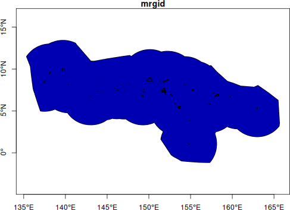
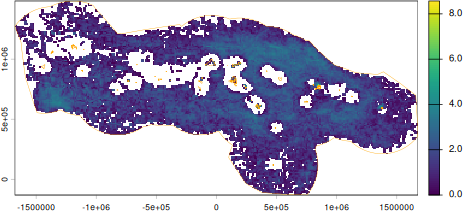
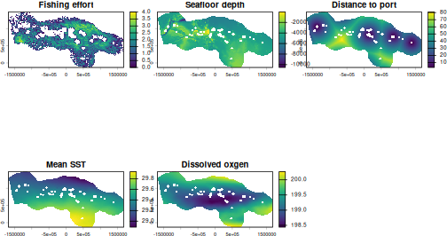
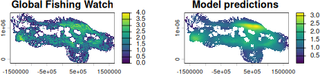

# Predicting fishing effort in Micronesia

``` r

library(oceandatr)
library(terra)
#> terra 1.9.27
library(sf)
#> Linking to GEOS 3.12.1, GDAL 3.8.4, PROJ 9.4.0; sf_use_s2() is TRUE
library(mgcv) #for Generalized Additive Modelling
#> Loading required package: nlme
#> This is mgcv 1.9-4. For overview type '?mgcv'.
```

We will create a Generalized Additive Model (GAM) of fishing effort in
the Exclusive Economic Zone (EEZ) of the Federated States of Micronesia
(FSM), using physical and environmental predictors obtained using the
`oceandatr` package, illustrating the usefulness of `oceandatr` for
retrieving, gridding, and transforming spatial data with minimal input
from the user. Note that this vignette is not intended as a guide to
GAMs - entire books are written about that.

## Obtain a spatial boundary for the area of interest

Download FSM’s EEZ using `oceandatr`

``` r

fsm <- get_boundary("Micronesia")

plot(fsm[,1], axes = T)
```



Federated States of Micronesia’s EEZ

## Get a suitable coordinate reference system for the area

The ocean boundary comes in the widely used, ‘unprojected’, coordinate
reference system (CRS) EPSG:4326. We will use a local, equal-area
projection, which we can find using the [Projection Wizard
website](https://projectionwizard.org/), entering the geographic extent
of the EEZ:

``` r

(geog_extent <- sf::st_bbox(fsm))
#>       xmin       ymin       xmax       ymax 
#> 135.315556  -1.171389 165.676111  13.440706
```

So the North extent coordinate is 14, South extent is -2, East extent is
166 E, and the West extent is 135 E. Putting this information in
Projection Wizard and clicking the “PROJ” link underneath the map, we
get a suitable equal-area projection.

``` r

fsm_proj <- "+proj=cea +lon_0=150.5 +lat_ts=7 +datum=WGS84 +units=m +no_defs"

# project the EEZ boundary into the local CRS
fsm_eez_proj <- fsm |> 
  sf::st_transform(fsm_proj) |> 
  vect() #convert to a SpatVector for easy plotting with the rasters
```

## Create a raster grid for our data

We can now create the grid we will use for all our data. The grid cell
size is set at 10 km to ensure that the model runs reasonably fast;
smaller grid cell sizes will result in more cells, and hence more data
in the model.

``` r

fsm_grid <- get_grid(fsm, resolution = 10e3, crs = fsm_proj)
```

## Fishing effort data

We can now retrieve gridded fishing effort data for FSM from Global
Fishing Watch. As noted in the help file (`?get_gfw()`), you need a
(free) API key from Global Fishing Watch for this to work. For
simplicity, we will use the mean total annual effort in each grid cell,
using data from 2024 and 2025. In a more detailed model setup, different
fishing gears, such as purse seine and longlines, could be modelled
separately, and time could be included as a factor in the model.

``` r

fishing_effort <- get_gfw(fsm_grid, 
                          start_year = 2024,
                          end_year = 2025,
                          group_by = "location",
                          summarise = "mean_total_annual_effort")

plot(log(fishing_effort+1))
lines(fsm_eez_proj, col = "orange", lwd = 0.5)
```



Mean annual fishing effort. 2024 - 2025

We plot the log+1 transformed data because there are many zero or near
zero values.

## Mask fishing effort nearshore

There are some anomalously high values close to the islands. No
industrial fishing is allowed within 12nm of shore in FSM, so to remove
these [missclassified
values](https://globalfishingwatch.org/faqs/port-buffer-explained/) we
can download FSM’s 12nm polygons and mask the fishing effort data.

``` r

fsm_12nm <- get_boundary("Micronesia", type = "12nm") |>
  sf::st_transform(fsm_proj)

fishing_effort_masked <- mask(fishing_effort, mask = fsm_12nm, inverse = TRUE)

plot(log(fishing_effort_masked+1))
```


Mean annual fishing effort with nearshore values removed.

## Retrieve predictor data

Bathymetry and environmental conditions, such as temperature,
chlorophyll concentration, and dissolved oxygen, are all known to the be
predictors of fish distributions. Distance from port is also a known
factor in predicting fishing effort. We will use these variables as
predictors of fishing effort in our simple model. All the data is
downloaded, gridded, and transformed to the correct CRS using
`oceandatr`.

``` r

# seafloor depth
bathy <- get_bathymetry(spatial_grid = fsm_grid,
                        classify_bathymetry = FALSE)
#> Downloaded and saved data chunk 1 of 2
#> Downloaded and saved data chunk 2 of 2
#> Finished! Data successfully streamed to /tmp/Rtmp3exIrx/bathy_135.32_165.68_-1.17_13.44.tif

# distance to ports data
dist_port <- get_dist(spatial_grid = fsm_grid,
                      dist_to = "ports")

# sea surface environmental data such as temperature and chlorophyll
enviro_data <- get_enviro_zones(fsm_grid, 
                                enviro_zones = FALSE)
#> Retrieving environmental data from https://erddap.bio-oracle.org/erddap/, or disk if previously downloaded.
#> Data retrieval complete
```

## Model

We will use a basic Generalized Additive Model (GAM), implemented using
the `mgcv` R package. First we create a multi-layer raster with all the
data we want to use in the model, in our case:

- Fishing effort (log+1 transformed)
- Seafloor depth
- Distance to port
- Mean sea surface temperature
- Dissolved oxygen

``` r

#create multi-layer raster with all data needed for modelling
model_data <- c(log(fishing_effort_masked+1), 
                bathy,
                dist_port,
                enviro_data[[c("Mean_temp", "Dissolved_oxygen")]]) |> 
  mask(fsm_12nm, inverse = TRUE)


plot(model_data, main = c("Fishing effort", "Seafloor depth", "Distance to port", "Mean SST", "Dissolved oxgen"))
```



Data for GAM

These data are then converted to a data frame for the modelling process.

``` r

# convert the raster to a dataframe
model_df <- model_data |> 
  as.data.frame(xy = TRUE, na.rm = TRUE)
```

Now we can create a basic GAM, using the gam() function from the package
mgcv. Predictor variables (seafloor depth, distance to port, SST and
dissolved oxygen) are modelled using penalized thin-plate regression
splines, while a geographic Gaussian process smoother is included to
account for spatial dependency across the pelagic grid. The model is
fitted via Restricted Maximum Likelihood (REML) estimation using the
log+1 transformed response (fishing effort) variable to address data
skewness and stabilize residual variance.

``` r

#run the GAM
fishing_model <- mgcv::gam(
  mean_total_annual_effort ~ 
    s(bathymetry) + 
    s(dist_ports) +
    s(Mean_temp) + 
    s(Dissolved_oxygen) + 
    s(x,y, bs = "gp"),
  data = model_df,
  method = "REML"
)

(model_summary <- summary.gam(fishing_model))
#> 
#> Family: gaussian 
#> Link function: identity 
#> 
#> Formula:
#> mean_total_annual_effort ~ s(bathymetry) + s(dist_ports) + s(Mean_temp) + 
#>     s(Dissolved_oxygen) + s(x, y, bs = "gp")
#> 
#> Parametric coefficients:
#>             Estimate Std. Error t value Pr(>|t|)    
#> (Intercept) 1.432412   0.003452     415   <2e-16 ***
#> ---
#> Signif. codes:  0 '***' 0.001 '**' 0.01 '*' 0.05 '.' 0.1 ' ' 1
#> 
#> Approximate significance of smooth terms:
#>                        edf Ref.df      F p-value    
#> s(bathymetry)        8.236  8.848  15.54  <2e-16 ***
#> s(dist_ports)        8.721  8.979  64.51  <2e-16 ***
#> s(Mean_temp)         8.886  8.995  86.41  <2e-16 ***
#> s(Dissolved_oxygen)  8.654  8.968  38.59  <2e-16 ***
#> s(x,y)              31.418 31.879 318.94  <2e-16 ***
#> ---
#> Signif. codes:  0 '***' 0.001 '**' 0.01 '*' 0.05 '.' 0.1 ' ' 1
#> 
#> R-sq.(adj) =  0.488   Deviance explained = 48.9%
#> -REML =  18879  Scale est. = 0.28235   n = 23696
```

The model successfully captured the spatial distribution of fishing
effort, accounting for 48.9 of the total deviance (adjusted R² = 0.488).
All predictor variables had highly significant, non-linear effects on
fishing distribution (p \< 0.001).

We can predict fishing effort using the GAM for the same model grid we
used as input, and compare the GFW data to the predictions.

``` r

# Predict using the GAM
model_df$predicted_effort <- mgcv::predict.gam(fishing_model)

# Convert back to a raster for mapping
pred_rast <- rast(model_df[, c("x", "y", "predicted_effort")], crs = fsm_proj)

#plot GFW data and predictions next to each other
par(mfrow = c(1,2))
plot(log(fishing_effort_masked+1), main = "Global Fishing Watch")
plot(pred_rast, main = "Model predictions ")
```



Model prediction compared to GFW data

Not bad for a very rough GAM!

When building a more robust model, diagnostic plots and information
should be examined, e.g. using `mgcv::plot.gam(fishing_model)` and
`mgcv::gam.check(fishing_model)`.
