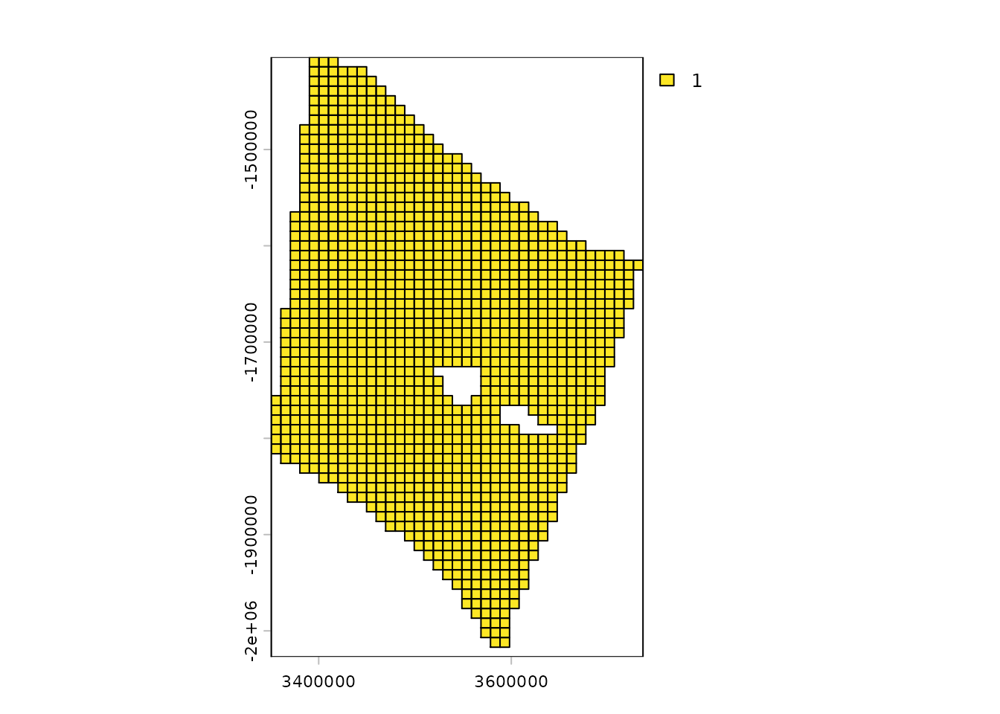
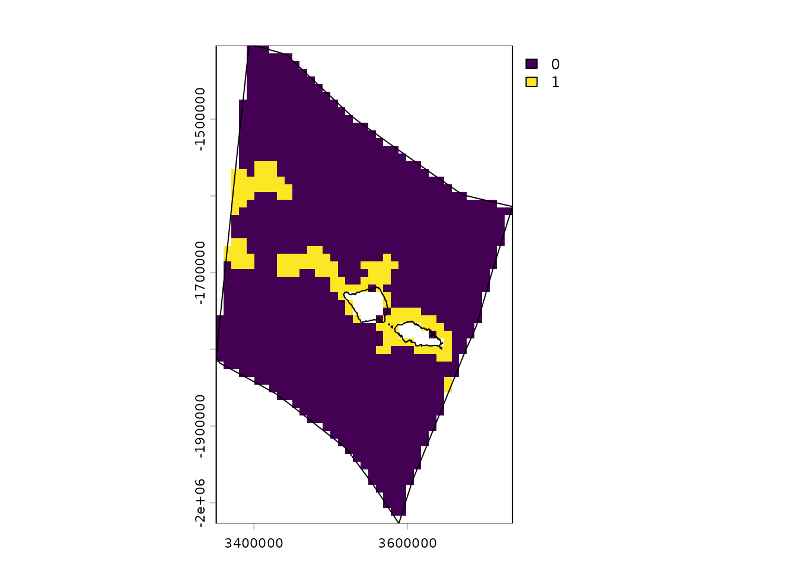
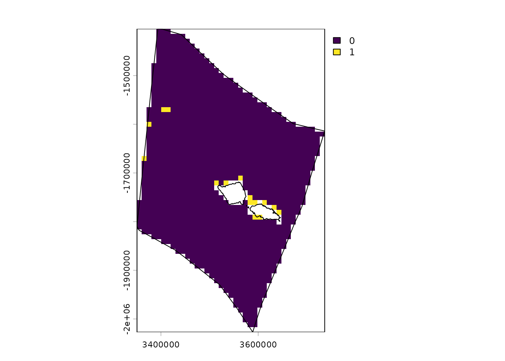
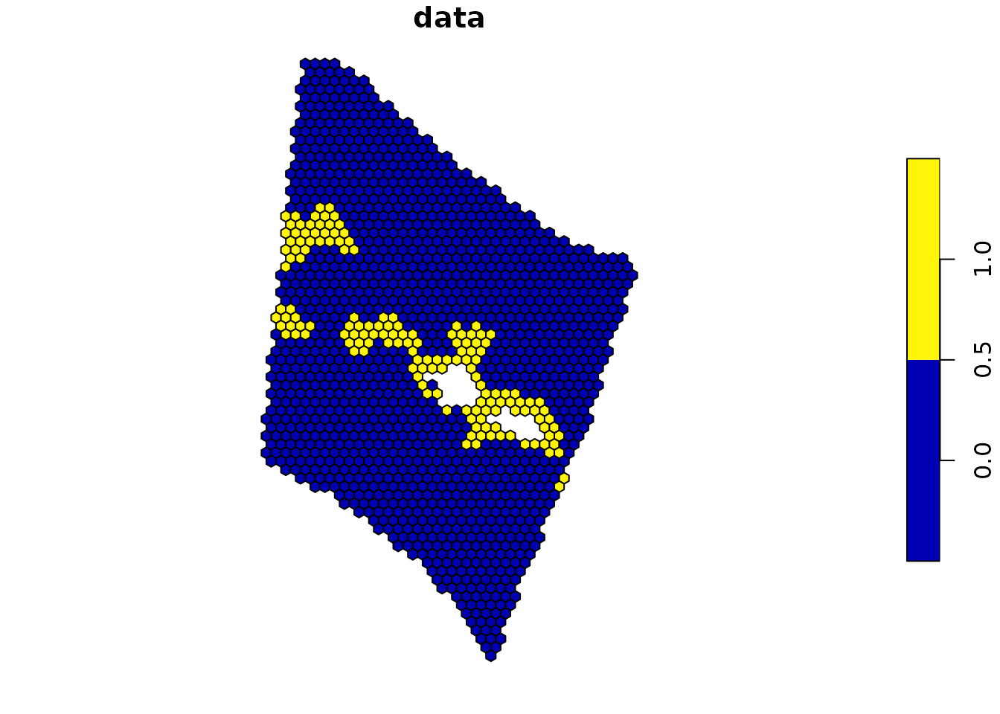
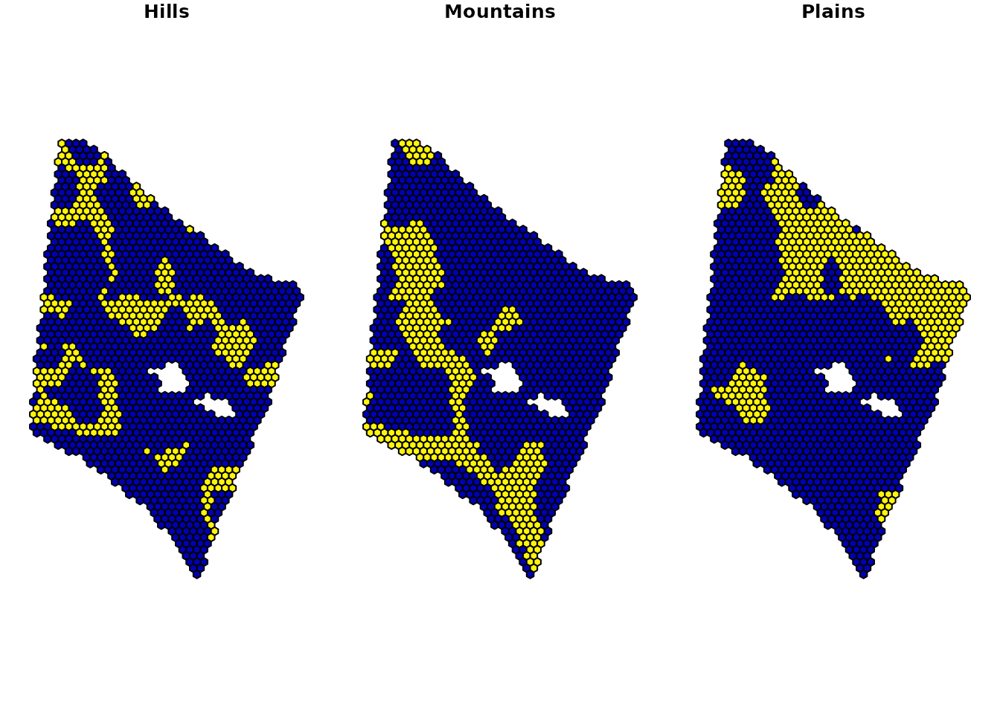
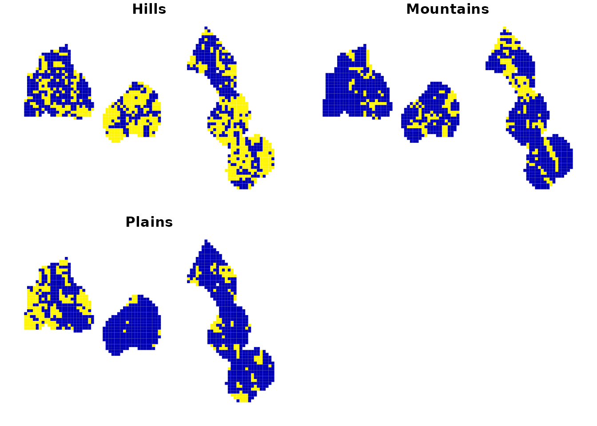
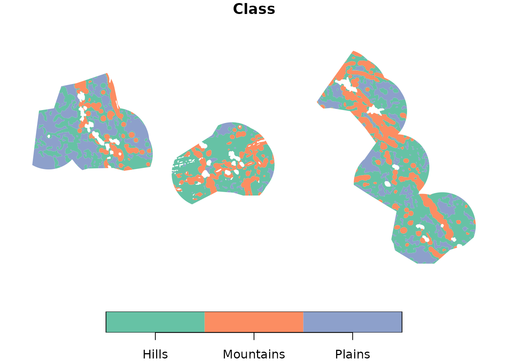
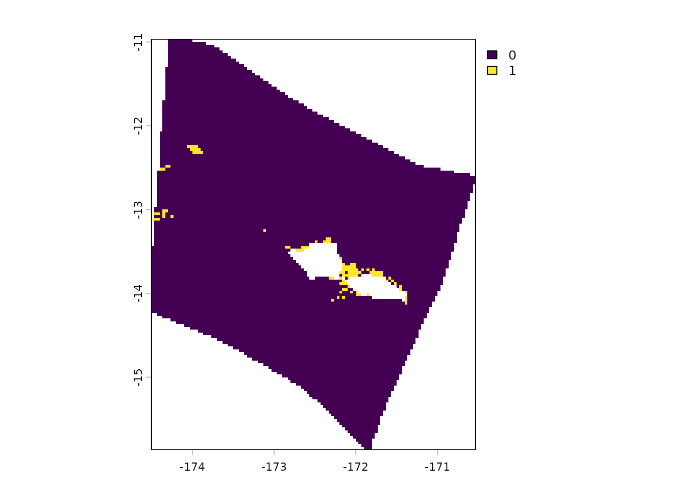

# Gridding spatial data

Apart from `oceandatr`’s for retrieving data from specific datasets,
such as
[`get_seamounts()`](https://emlab-ucsb.github.io/oceandatr/reference/get_seamounts.md),
there are three generic functions:

- [`get_boundary()`](https://emlab-ucsb.github.io/oceandatr/reference/get_boundary.md):
  retrieves the boundaries for a marine or terrestrial area, such as a
  country or Exclusive Economic Zone (EEZ)
- [`get_grid()`](https://emlab-ucsb.github.io/oceandatr/reference/get_grid.md):
  creates a spatial grid
- [`get_data_in_grid()`](https://emlab-ucsb.github.io/oceandatr/reference/get_data_in_grid.md):
  grids spatial data; can also be used to crop/ intersect a polygon with
  data

This vignette show how to use these functions for get gridded data, in
[`terra::rast`](https://rspatial.github.io/terra/reference/rast.html)
and `sf` format, using the EEZ’s of Samoa and Kiribati as examples.

``` r

#load the package
library(oceandatr)
```

## Get a boundary

We can obtain grids in raster
([`terra::rast`](https://rspatial.github.io/terra/reference/rast.html))
or vector (`sf`) format. First we need a polygon that we want to create
a grid for. We can retrieve boundaries for countries, Exclusive Economic
Zones (EEZs), oceans, and several other jurisdiction types using
[`get_boundary()`](https://emlab-ucsb.github.io/oceandatr/reference/get_boundary.md).
In this example we will get the EEZ for the Pacific nation of Samoa.

``` r

#get Samoa's EEZ
samoa_eez <- get_boundary(name = "Samoa")

plot(samoa_eez["geometry"], axes = TRUE)
```


## Get a grid

We also need to provide a suitable projection for the area we are
interested in. [Projection Wizard](https://projectionwizard.org) is
useful for this purpose. For spatial planning, equal area projections
are normally best. A good option for the Pacific is
[EPSG:8859](https://spatialreference.org/ref/epsg/8859/), which is equal
area and centered on the Pacific.

``` r


samoa_projection <- '+proj=laea +lon_0=-172.5 +lat_0=0 +datum=WGS84 +units=m +no_defs'

# Create a raster grid with 10km sized cells
samoa_grid <- get_grid(boundary = samoa_eez, resolution = 10000, crs = 8859)

#plot the grid
terra::plot(samoa_grid)
terra::lines(terra::as.polygons(samoa_grid, dissolve = FALSE)) #add the outlines of each cell
```



To obtain a grid in `sf` format we can use arguments
`option = "sf_square"` or `option = "sf_hex"` in `get_grid` to specify
square or hexagonal cells. We will create and plot a hexagonal grid with
10 km wide cells.

``` r

samoa_grid_sf <- get_grid(boundary = samoa_eez, resolution = 10000, crs = 8859, output = "sf_hex")

plot(samoa_grid_sf)
```


## Grid data

Now we can grid some data. Data can be in raster
([`terra::rast`](https://rspatial.github.io/terra/reference/rast.html))
or `sf` format. Here’s an example using a global map of seafloor ridges
which is in `sf` format:

``` r

# ridges data for area of Pacific
ridges <- readRDS(system.file("extdata", "ridges_pacific.rds", package = "oceandatr"))

#grid the data
ridges_gridded <- get_data_in_grid(spatial_grid = samoa_grid, dat = ridges)

#plot
terra::plot(ridges_gridded)
terra::lines(samoa_eez |> sf::st_transform(crs = 8859)) #add Samoa's EEZ
```



And another example using raster data, in this case global cold water
coral distribution data which has been pre-cropped to the Pacific

``` r

#load cold water coral data
cold_coral <- terra::rast(system.file("extdata", "cold_coral_pacific.tif", package = "oceandatr"))

#grid the data
coral_gridded <- get_data_in_grid(spatial_grid = samoa_grid, dat = cold_coral, meth = "near")

#plot
terra::plot(coral_gridded)
terra::lines(samoa_eez |> sf::st_transform(crs = 8859)) #add Samoa's EEZ
```



We can also use the sf grid we created to return gridded data in sf
format:

``` r

#grid the data
ridges_gridded_sf <- get_data_in_grid(spatial_grid = samoa_grid_sf, dat = ridges)

#plot
plot(ridges_gridded_sf)
```



We can also grid `sf` data that contains multiple data features, such as
habitat types. To do this, we provide the name of the column that
contains the names of the features we want to grid as the
`feature_names` argument in `get_data_data_in_grid()`. This creates a
multi-layer grid. For raster data this means multiple raster layers and
for `sf` grids multi-column objects. Here’s an example using `sf` data
that classifies the worlds abyssal oceans into 3 categories:

``` r

#load the data
abyssal_features <- system.file("extdata", "abyssal_classes_pacific.rds", package = "oceandatr") |>
  readRDS()

#grid the data
abyssal_features_sf <- get_data_in_grid(spatial_grid = samoa_grid_sf, dat = abyssal_features, feature_names = "Class")

#plot
plot(abyssal_features_sf)
```



`oceandatr` also works with grids that cross the antimeridian
(international date line). You can set `antimeridian = TRUE` in
`get_data_in_grid` if you know you are using a grid that crosses the
antimeridian, or if `antimeridian = NULL` (the default option), the
function will automatically determine if the grid crosses the
antimeridian. Here’s an example using Kiribati’s EEZ as the grid area.

``` r

#load the Kiribati EEZ polygon
kir_eez <- get_boundary(name = "Kiribati", country_type = "sovereign")

#create a grid for the Kiribati EEZ - Equal area projection obtained from https://projectionwizard.org
kir_grid <- get_grid(boundary = kir_eez, resolution = 50000, crs = 8859, output = "sf_square")

#get abyssal plains classification for Kiribati grid
kir_abyssal_features <- get_data_in_grid(spatial_grid = kir_grid, dat = abyssal_features, feature_names = "Class")

#plot
plot(kir_abyssal_features, border = FALSE)
```



## Get raw data

If you just want to get data for an area, but don’t want to grid it, you
can provide an `sf` polygon to
[`get_data_in_grid()`](https://emlab-ucsb.github.io/oceandatr/reference/get_data_in_grid.md)
and set `raw = TRUE`.

``` r

kir_abyssal_features_raw <- get_data_in_grid(spatial_grid = kir_eez, dat = abyssal_features, raw = TRUE)

#shift longitude to make it easier to view data
plot(kir_abyssal_features_raw[1] |> sf::st_shift_longitude(), border = FALSE)
```



``` r

samoa_coral_raw <- get_data_in_grid(spatial_grid = samoa_eez, dat = cold_coral, raw = TRUE, meth = "near")

terra::plot(samoa_coral_raw)
```


