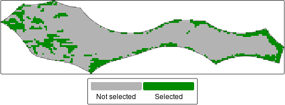

# Usage of oceandatr for spatial planning

This example demonstrates the usage of `oceandatr` to acquire and
process data ready for using in a spatial prioritization using the
[`prioritizr`](https://prioritizr.net/) R package. To extend
prioritizr’s capabilities, another package,
[`patchwise`](https://github.com/emlab-ucsb/patchwise), is used to
ensure that entire seamounts are included in the prioritization
solutions.

We use a High Seas area of the Pacific as the planning area for this
example since it is outside any states’ jurisdiction.

``` r
#load oceandatr package
library(oceandatr)
```

Along with `oceandatr` we will need to load `prioritizr` for the spatial
prioritization and we will use the open source solver `lsymphony` to
solve the prioritization problem, so this needs to be installed and
loaded via the Bioconductor website

``` r
library(gfwr)
library(prioritizr)
#remotes::install_bioc("lpsymphony")
library(lpsymphony)
#remotes::install_github("emlab-ucsb/patchwise")
library(patchwise)
library(tmap) #for making nice maps
library(terra) #for raster data handling

terraOptions(progress = 0) #suppress the progress bars during large terra operations
```

## High Seas area of the Pacific Ocean

First we retrieve geospatial data for the North Pacific Ocean using
[`get_boundary()`](https://emlab-ucsb.github.io/spatialgridr/reference/get_boundary.html),
then we will crop for the area we are interested in, the planning
region, highlighted in red on the map.

``` r
high_seas <- get_boundary(type = "high_seas")

pacific_hs_area_extent <- sf::st_bbox(c(xmin = 135, xmax = 155, ymin = 0, ymax = 6), crs = 4326)

plot(sf::st_geometry(high_seas), main = "High Seas", col = "royalblue3", axes = TRUE, las = 1)
plot(pacific_hs_area_extent %>% sf::st_as_sfc() %>% sf::st_cast(to = "LINESTRING"), col = "red", lwd=2, add = TRUE)
```


Map the area of interest (red box) in the High Seas

We are going to use only the highlighted Pacific area which borders
Indonesia, Papua New Guinea, Palau and the Federated States of
Micronesia. We can get the EEZs of these states using `oceandatr`’s
`get_boundary` function.

``` r

country_names <- c("Indonesia", "Papua New Guinea", "Palau", "Micronesia")

eezs <- lapply(country_names, FUN = function(x) get_boundary(name = x) %>% dplyr::select(territory1) %>% dplyr::rename(name = territory1)) %>% 
  do.call(rbind, .) %>% 
  sf::st_cast(to = "MULTIPOLYGON")
```

We only want the high seas portion of the area outlined above. We can
create a polygon for this planning region by removing the bordering
states EEZs.

``` r
sf::sf_use_s2(FALSE) #turn off S2 to avoid errors

pacific_hs <- high_seas %>%
  sf::st_crop(pacific_hs_area_extent) %>% 
  sf::st_sf() %>% 
  dplyr::mutate(name = "Planning region") %>% 
  dplyr::select(name)

sf::sf_use_s2(TRUE)
```

To make a nice context map, we can download bathymetry data using
`oceandatr`’s
[`get_bathymetry()`](https://emlab-ucsb.github.io/oceandatr/reference/get_bathymetry.md)
function, using the bounding box of the EEZs as the input extent (grid).
To get country boundaries to add to the map, we use the
[`get_boundary()`](https://emlab-ucsb.github.io/spatialgridr/reference/get_boundary.html)
functions from `oceandatr`, setting `name = NULL` so that all countries
are downloaded. We can then plot everything using the `tmap` package,
which is great for making nice maps.

``` r

#retrieve bathymetry for the planning regions and surrounding area bounded by the EEZs
pacific_bathy <- get_bathymetry(spatial_grid = sf::st_as_sfc(sf::st_bbox(eezs), crs = 4326) %>% sf::st_as_sf(), raw = TRUE, classify_bathymetry = FALSE) %>%
  terra::classify(matrix(c(0, Inf, NA), ncol = 3))

#retrieve country boundaries using oceandatr
world <- get_boundary(name = NULL, type = "country")

tm_shape(pacific_bathy * -1) + #multiply bathymetry by -1 to make values positive for nicer legend
  tm_raster(
    col.scale = tm_scale_continuous(values = "brewer.yl_gn_bu"),
    col.legend = tm_legend(title = "Depth (m)", position = tm_pos_out("right"), title.size = 1.5, text.size = 1.2)
  ) +
  tm_shape(eezs %>% sf::st_cast(to = "MULTILINESTRING")) +
  tm_lines(
    col = "name",
    lwd = 1.5,
    col.scale = tm_scale_categorical(values = "brewer.dark2"),
    col.legend = tm_legend(title = "Select EEZs", title.size = 1.5, text.size = 1.2)
  ) +
  tm_shape(pacific_hs %>% sf::st_cast(to = "MULTILINESTRING")) +
  tm_lines(
    col = "name",
    lwd = 2,
    col.scale = tm_scale_categorical(values = "red"),
    col.legend = tm_legend(title = "")
  ) +
  tm_shape(world) +
  tm_borders() +
  tm_graticules(lwd = 0.5)
```


Map of Pacific High Seas planning region in regional context

Now we select a suitable projection for the area and a suitable
resolution for the planning grid used for gridding the data. We can use
[projection wizard](https://projectionwizard.org) to find an equal-area
projection, entering the same extent coordinates we used to crop the
high seas area (xmin = 135, xmax = 155, ymin = 0, ymax = 6).

We will use 10km square planning units so that there the data processing
and prioritization run reasonably fast (smaller planning units will
require more time/ computer memory get data for)

``` r

pacific_hs_projection <- "+proj=cea +lon_0=145 +lat_ts=3 +datum=WGS84 +units=m +no_defs"

pacific_hs_planning_grid <- get_grid(boundary = pacific_hs,
                                     crs = pacific_hs_projection,
                                     resolution = 10000) 

#get_grid returns a raster by default, so we can plot it using the terra package. We convert it to polygons so we can see each grid square.
terra::plot(terra::as.polygons(pacific_hs_planning_grid, aggregate = FALSE))
```


Pacific High Seas area planning grid raster

Now we have a planning grid, we can get data on conservation features
(e.g. habitats) using `oceandatr` to use in a spatial prioritization
with a single command
[`get_features()`](https://emlab-ucsb.github.io/oceandatr/reference/get_features.md).
We have to set the seamount buffer, which is the area around the
seamount that is included as part of the seamount, and we use 30km based
since biodiversity is known to be higher within this distance of
seamount peaks (see `?get_seamounts_buffered` for more info).

``` r
#set seed for reproducibility in the get_enviro_zones() sampling to find optimal cluster number
set.seed(500)

feature_set <- get_features(spatial_grid = pacific_hs_planning_grid) %>% 
  remove_empty_layers()  #use this to remove raster layers that are empty
```

``` r
tm_shape(setNames(
  feature_set,
  gsub("_", " ", names(feature_set)) %>% stringr::str_to_sentence()
)) +
  tm_raster(
    col.scale = tm_scale_categorical(
      values = c("grey70", "royalblue"),
      labels = c("Absent", "Present")
    ),
    col.legend = tm_legend(title = "",
                           orientation = "landscape",
                           position = tm_pos("center", "bottom", pos.h = "center"), 
                           text.size = 1),
    col.free = FALSE
  ) +
  tm_facets(ncol = 4) +
  tm_shape(pacific_hs %>% sf::st_transform(pacific_hs_projection)) +
  tm_borders() +
  tm_layout(panel.label.size = 1.5)
```


Maps showing presence or absence of conservation features in the
planning region

## Cost data: Global Fishing Watch data

The other piece of data needed for a spatial prioritization is cost. In
terrestrial spatial planning, this can be the actually monetary value of
buying the land for conservation. In marine spatial planning, measures
of fishing, such as catch and fishing effort, are often used as the
opportunity cost for each planning unit.

[Global Fishing Watch](https://globalfishingwatch.org/) has global
fishing effort data, and this can be accessed easily using
[`get_gfw()`](https://emlab-ucsb.github.io/oceandatr/reference/get_gfw.md)
function in `oceandatr` (which is a wrapper for the
[`get_raster()`](https://globalfishingwatch.github.io/gfwr/reference/gfw_renamed.html)
function from the [`gfwr`](https://github.com/GlobalFishingWatch/gfwr)
package). An API key is required, but can be easily generated at no
cost; see the `gfwr` website for more details.

``` r

fishing_effort <- get_gfw(spatial_grid = pacific_hs_planning_grid, start_year = 2022, end_year = 2022, summarise = "total_annual_effort") %>% 
  terra::subst(NA, 0.01) %>% #set NA values to zero otherwise they will be left out of the prioritization
  terra::mask(pacific_hs_planning_grid) %>% 
  setNames("fishing_effort")

tm_shape(fishing_effort) +
  tm_raster(col.scale = tm_scale(values = "viridis"),
            col.legend = tm_legend(orientation = "landscape",
                                   title = "", 
                                   text.size = 1.5))
```


Map of total apparent fishing effort in 2022 for the Pacific High Seas
area. Data from Global Fishing Watch

## Run a simple spatial prioritization

We now have all the data we need to create a conservation problem and
solve it to get a map of priority areas for conservation for our Pacific
High Seas area. For the prioritization, we need to set targets for how
much of each conservation feature must be included in the prioritized
areas. We will set this at 20%.

``` r
prob <- prioritizr::problem(x = fishing_effort, features = feature_set) %>% 
  add_min_set_objective() %>% 
  add_relative_targets(0.2) %>% 
  #add_boundary_penalties(penalty = 0.00001) %>% 
  add_binary_decisions() %>% 
  add_lpsymphony_solver(verbose = FALSE)

sol <- solve(prob)
```

``` r
tm_shape(sol) +
  tm_raster(
    col.scale = tm_scale_categorical(values = c("grey70", "green4"),
                                           labels =  c("Not selected", "Selected")),
    col.legend = tm_legend(title = "",
                           orientation = "landscape",
                           position = tm_pos_out("center", "bottom"), 
                           text.size = 1.5)) +
  tm_shape(pacific_hs %>% sf::st_transform(pacific_hs_projection)) +
  tm_borders()
```



Prioritization solution

## Prioritization with patches

Seamounts are known to be hotspots of biodiversity, so we might want to
include only whole seamounts in the prioritization result, rather than
parts of several seamounts. To ensure that whole seamount areas area
included, we need to use the `patchwise` package to do some
pre-processing of the data we use. The prioritization result is similar
to that above, but whole seamount patches equal to at least 20% of the
total seamount area are included.
