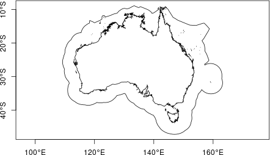
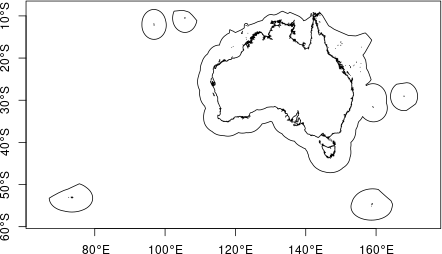
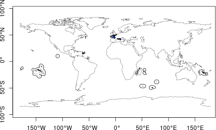
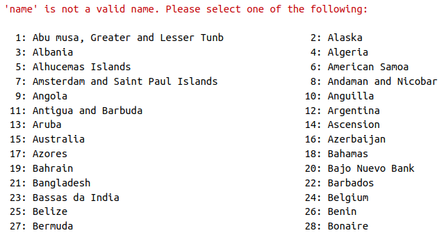
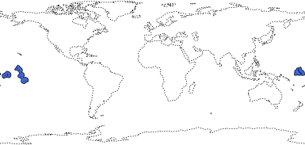
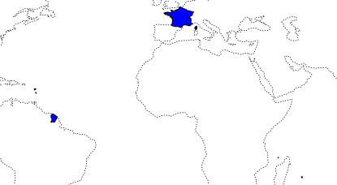
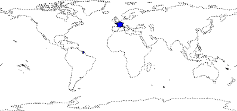

``` r
#load oceandatr package
library(oceandatr)
```


`get_boundary()` can be used to retrieve a variety of marine and terrestrial boundary types. Details on the options are in the help file `?get_boundary()`, but figuring out exactly how to get a particular type of boundary can still be confusing. Here we provide some examples. 

# Marine boundaries

`get_boundary()` uses the `mregions2::mrp_get()` function from the [`mregions2`](https://lifewatch.github.io/mregions2/) package - the R package for the Marine Regions database. This database is quite extensive and has several options for querying areas. `get_boundary()` is not intended to provide all the functionality of `mregions2`, just a slightly simpler interface for getting commonly used boundaries such as exclusive economic zones (EEZs), global ocean boundaries, and high seas areas.

When using `get_boundary()` with `type = "eez"`, `type = "12nm"` or `type = "24nm"`, the `country_type` can be either `country_type = "country"` or `country_type = "sovereign"`. Using `"country"` returns only the EEZ, 12nm or 24nm boundary of the mainland country, while using `"sovereign"` returns boundaries for all the states and territories that a country has sovereignty over as well. The examples below show how this works. 

Note that if `type = "ocean"` or `type = "high_seas"`, `country_type` is ignored.

Here is a simple query to get Australia's EEZ:


``` r
aus_eez <- get_boundary(name = "Australia", type = "eez")

plot(aus_eez["geometry"], axes = TRUE)
```



But lets look at what happens if we change the `country_type` from the default `"country"` to `"sovereign"`:


``` r
aus_eez_sov <- get_boundary(name = "Australia", type = "eez", country_type = "sovereign")

plot(aus_eez_sov["geometry"], axes = TRUE)
```



We now get not just the main country of Australia, but all the islands it has sovereignty over. For more detail, see the [Marine Regions attribute table](https://marineregions.org/eezattribute.php); using `country_type = "country"` queries using the 'territory1' attribute, and using `country_type = "sovereign"` uses the 'territory1' attribute.

Here is another example using France. Only the EEZ bordering mainland France is retrieved if `country_type = "country"`, but setting `country_type = "sovereign"` we also get all the islands France has sovereignty over.


``` r
fr_eez <- get_boundary(name = "France", type = "eez", country_type = "country")

fr_eez_sov <- get_boundary(name = "France", type = "eez", country_type = "sovereign")


plot(sf::st_geometry(fr_eez_sov), lwd = 1, axes = TRUE)
plot(fr_eez["geometry"], col = "royalblue", add = T)
plot(rnaturalearth::ne_coastline(scale = 110)["geometry"], lty = 3, add = TRUE)
```

<div class="figure" style="text-align: center">

<p class="caption">EEZ of mainland France (blue) and all overseas territories (solid outlines). World coastlines are shown as dashed line for reference.</p>
</div>

An example, where you might want to use `sovereign` is when you are trying to get all the islands that make up Kiribati. Using `country_type = "country"` does not return anything because each island group is listed as a country. Note that if the `name` provided is not found, a list of all possible `country_type` options to chose from is provided (only part of the output is shown for brevity):


``` r
get_boundary(name = "Kiribati", type = "eez", country_type = "country")
```


Try again, setting `country_type = "sovereign"`:


``` r
kir_eez <- get_boundary(name = "Kiribati", type = "eez", country_type = "sovereign")

plot(sf::st_geometry(kir_eez), col = "royalblue")
plot(rnaturalearth::ne_coastline(scale = 110)["geometry"], lty = 3, add = TRUE)
```

<div class="figure" style="text-align: center">

<p class="caption">Kiribati's EEZ. World coastlines are shown as dashed line for reference.</p>
</div>


The `mregions2` package can be used to query many different marine boundaries, not all of which are included as options for `get_boundary()`:


``` r
mregions2::mrp_list[,c("title", "layer")]
```


|title                                                                                                                         |layer                        |
|:-----------------------------------------------------------------------------------------------------------------------------|:----------------------------|
|Exclusive Economic Zones (200 NM) (v11, world, 2019)                                                                          |eez                          |
|Maritime Boundaries (v11, world, 2019)                                                                                        |eez_boundaries               |
|Territorial Seas (12 NM) (v3, world, 2019)                                                                                    |eez_12nm                     |
|Contiguous Zones (24 NM) (v3, world, 2019)                                                                                    |eez_24nm                     |
|Internal Waters (v3, world, 2019)                                                                                             |eez_internal_waters          |
|Archipelagic Waters (v3, world, 2019)                                                                                         |eez_archipelagic_waters      |
|High Seas (v1, world, 2020)                                                                                                   |high_seas                    |
|Extended Continental Shelves (v01, world, 2022)                                                                               |ecs                          |
|Extended Continental Shelves - boundaries (v01, world, 2022)                                                                  |ecs_boundaries               |
|IHO Sea Areas (v3)                                                                                                            |iho                          |
|Global Oceans and Seas (v1)                                                                                                   |goas                         |
|The intersect of the Exclusive Economic Zones and IHO areas (v4)                                                              |eez_iho                      |
|Marine and land zones: the union of world country boundaries and EEZ's                                                        |eez_land                     |
|Global Biogeochemical Provinces (Longhurst)                                                                                   |longhurst                    |
|Global contourite distribution                                                                                                |cds                          |
|Emission Control Areas (ECAs) designated under regulation 13 of MARPOL Annex VI (NOx emission control)                        |eca_reg13_nox                |
|Emission Control Areas (ECAs) designated under regulation 14 of MARPOL Annex VI (SOx and particulate matter emission control) |eca_reg14_sox_pm             |
|UNESCO World Heritage Marine Sites (v02, 2023)                                                                                |worldheritagemarineprogramme |
|The 66 Large Marine Ecosystems of the World                                                                                   |lme                          |
|Marine Ecoregions of the World - Ecoregions                                                                                   |ecoregions                   |
|SeaVoX - Sea Areas Polygons (v18, 2021)                                                                                       |seavox_v18                   |


# Land boundaries

`get_boundary()` uses the `rnaturalearth::ne_countries()` function from the [`rnaturalearth``](https://docs.ropensci.org/rnaturalearth/index.html) package to retrieve land boundaries. `get_boundary()` is only intended to provide a slightly simpler interface for getting some commonly used land boundaries.

As with maritime boundaries, the `country_type` can be specified as either `country_type = "country"` or `country_type = "sovereign"` depending on whether only the main country is required or the country and all territories/ states it has sovereignty over. The following examples show how these options work in practice. 

The `rnaturalearth` package [vignette](https://docs.ropensci.org/rnaturalearth/articles/rnaturalearth.html) contains more details about what constitutes a country and more options for querying.

If we query France setting `country_type = "country"` we get:


``` r
france <- get_boundary(name = "France", type = "countries", country_type = "country")

plot(sf::st_geometry(france), col = "blue")
plot(rnaturalearth::ne_coastline(scale = 110)["geometry"], lty = 3, add = TRUE)
```



This is slightly unexpected perhaps, but the islands of Guadeloupe and Martinique in the Caribbean, Mayotte and Réunion in the Western Indian Ocean, and French Guiana in South America, all have the same status as mainland France.

If we use `country_type = "sovereign"`, we also get France's overseas territories in the Pacific, Atlantic and Antarctic:


``` r
france_sov <- get_boundary(name = "France", type = "countries", country_type = "sovereign")

plot(sf::st_geometry(france_sov), col = "blue")
plot(rnaturalearth::ne_coastline(scale = 110)["geometry"], lty = 3, add = TRUE)
```


