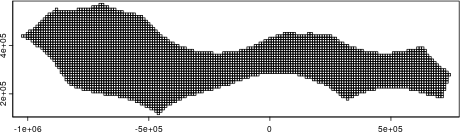

This example walks though how to do a spatial prioritization using `oceandatr` to obtain suitable data, and also using the package [`patchwise`](https://github.com/emlab-ucsb/patchwise) to ensure that entire seamounts are included in the prioritization solutions.

We use a High Seas area of the Pacific as the planning area for this example since it is outside any states' jurisdiction.


Along with `oceandatr` we will need to load `prioritizr` for the spatial prioritization and we will use the open source solver `lsymphony` to solve the prioritization problem, so this needs to be installed and loaded via th Bioconductor website 


```r
library(oceandatr)
library(gfwr)
library(prioritizr)
#remotes::install_bioc("lpsymphony")
library(lpsymphony)
#remotes::install_github("emlab-ucsb/patchwise")
library(patchwise)
```

# High Seas area of the Pacific Ocean

First we retrieve the entire High Seas geospatial data, then we will crop for the area we are interested in, highlighted in red on the map.


```r
hs <- get_area(area_name = "63203", query_type = "high_seas", mregions_column = "mrgid")

pacific_hs_area_extent <- sf::st_bbox(c(xmin = 135, xmax = 155, ymin = 0, ymax = 6), crs = 4326)

plot(sf::st_geometry(hs), main = "High Seas", col = "royalblue3", axes = TRUE, las = 1)
plot(pacific_hs_area_extent %>% sf::st_as_sfc() %>% sf::st_cast(to = "LINESTRING"), col = "red", lwd=2, add = TRUE)
```


We are going to use only the highlighted Pacific High Seas area which borders Indonesia, Papua New Guinea, Palau and the Federated States of Micronesia. We can get the EEZs of these states using `oceandatr`'s `get_area` function.


```r

country_names <- c("Indonesia", "Papua New Guinea", "Palau", "Micronesia")

eezs <- lapply(country_names, FUN = function(x) get_area(area_name = x) %>% dplyr::select(territory1) %>% dplyr::rename(name = territory1)) %>% 
  do.call(rbind, .) %>% 
  sf::st_cast(to = "MULTIPOLYGON")
```


```r
sf::sf_use_s2(FALSE) #turn off S2 to avoid errors

pacific_hs <- hs %>% 
  sf::st_crop(pacific_hs_area_extent) %>% 
  dplyr::mutate(name = "Pacific High Seas area") %>% 
  dplyr::select(name)

sf::sf_use_s2(TRUE)

plot(rbind(sf::st_cast(pacific_hs, to = "MULTIPOLYGON"), eezs), axes = TRUE, las = 1, main = NULL, key.pos = 4)
```


Now we select a suitable projection for the area and a suitable resolution for the planning grid used for gridding the data. We can use [projection wizard](https://projectionwizard.org) to find an equal-area projection, entering the same extent coordinates we used to crop the high seas area (xmin = 135, xmax = 155, ymin = 0, ymax = 6). 

We will use 10km square planning units so that there the data processing and prioritization run reasonably fast (smaller planning units will require more time/ computer memory get data for)


```r

pacific_hs_projection <- "+proj=cea +lon_0=145 +lat_ts=3 +datum=WGS84 +units=m +no_defs"

pacific_hs_planning_grid <- get_grid(area_polygon = pacific_hs,
                                   projection_crs = pacific_hs_projection,
                                   resolution = 10000) 

#get_grid returns a raster by default, so we can plot it using the terra package
terra::plot(pacific_hs_planning_grid, col = "grey70")
```




Now we have a planning grid, we can get data on conservation features (e.g. habitats) using `oceandatr` to use in a spatial prioritization with a single command `get_features()`. We have to set the seamount buffer, which is the area around the seamount that is included as part of the seamount, and we use 30km based since biodiversity is known to be higher within this distance of seamount peaks (see `?get_seamounts_buffered` for more info).


```r
feature_set <- get_features(spatial_grid = pacific_hs_planning_grid, seamount_buffer = 30000)

terra::plot(feature_set, maxnl = terra::nlyr(feature_set), fun = function(x)terra::lines(pacific_hs %>% sf::st_transform(pacific_hs_projection))) #set maximum number of layers to plot to the same as the number of layers in the feature set
```


# Cost data: Global Fishing Watch data

The other piece of data needed for a spatial prioritization is cost. In terrestrial spatial planning, this can be the actually monetary value of buying the land for conservation. In marine spatial planning, measures of fishing, such as catch and fishing effort, are often used as the opportunity cost for each planning unit.

[Global Fishing Watch](https://globalfishingwatch.org/) has global fishing effort data, and this can be accessed easily using the R package [`gfwr`](https://github.com/GlobalFishingWatch/gfwr). An API key is required, but can be easily generated at no cost; see the `gfwr` website for more details.


```r
pacific_hs_geojson <- pacific_hs_area_extent %>% #use the larger area extent because using just the pacific_hs polygon results in a slightly truncated area
  sf::st_as_sfc() %>% 
  sf::st_as_sf() %>% 
  gfwr::sf_to_geojson()

fishing_effort <- gfwr::get_raster(spatial_resolution = 'low',
                                   temporal_resolution = 'yearly',
                                   group_by = 'gearType', 
                                   date_range = '2022-01-01,2022-12-31',
                                   region = pacific_hs_geojson,
                                   region_source = 'user_json')

total_annual_effort <- fishing_effort %>% 
  dplyr::group_by(Lat, Lon, `Time Range`) %>% 
  dplyr::summarise(total_effort = sum(`Apparent Fishing Hours`, na.rm = TRUE)) %>% 
  dplyr::ungroup() %>% 
  dplyr::select("Lon", "Lat", "total_effort") %>%
  terra::rast(type = "xyz", crs = "epsg:4326") %>% 
  terra::subst(NA, 0.01) %>% 
  get_data_in_grid(spatial_grid = pacific_hs_planning_grid,
                                   dat = .,
                                   name = "fishing_effort")

terra::plot(total_annual_effort, fun = terra::lines(pacific_hs %>% sf::st_transform(pacific_hs_projection)))
```


# Run a simple spatial prioritization

We now have all the data we need to create a conservation problem and solve it to get a map of priority areas for conservation for our Pacific High Seas area. For the prioritization, we need to set targets for how much of each conservation feature must be included in the prioritized areas. We will set this at 20%.


```r
prob <- prioritizr::problem(x = total_annual_effort, features = feature_set) %>% 
  add_min_set_objective() %>% 
  add_relative_targets(0.2) %>% 
  #add_boundary_penalties(penalty = 0.00001) %>% 
  add_binary_decisions() %>% 
  add_lpsymphony_solver(verbose = FALSE)

sol <- solve(prob)

terra::plot(sol, main = "Solution", axes = TRUE, 
            col = c("grey70", "green4"),
            type = "classes",
            levels = c("Not selected", "Selected"),
            fun = terra::lines(pacific_hs %>% sf::st_transform(pacific_hs_projection)))
terra::plot(terra::as.polygons(feature_set[["seamounts"]]), add=TRUE)
```


# Prioritization with patches

To ensure that whole seamount areas area included in the solution, we need to use the `patchwise` package to do some pre-processing of the data we use. The prioritization result is similar to that above, but whole seamount patches equal to at least 20% of the total seamount area are included.


```r
# Separate seamount data - we want to protect entire patches
seamounts_rast <- feature_set[["seamounts"]]
features_rast <- feature_set[[names(feature_set)[names(feature_set) != "seamounts"]]]

# Create seamount patches - seamount areas that touch are considered the same patch
patches_rast <- patchwise::create_patches(seamounts_rast)

# Create patches dataframe - this creates several constraints so that entire seamount units are protected together
patches_df_rast <- patchwise::create_patch_df(planning_grid = pacific_hs_planning_grid, features = features_rast, patches = patches_rast, costs = total_annual_effort)
#> [1] "Processing patch 1 of 6"
#> [1] "Processing patch 2 of 6"
#> [1] "Processing patch 3 of 6"
#> [1] "Processing patch 4 of 6"
#> [1] "Processing patch 5 of 6"
#> [1] "Processing patch 6 of 6"

# Create boundary matrix for prioritizr
boundary_matrix_rast <- patchwise::create_boundary_matrix(planning_grid = pacific_hs_planning_grid, patches = patches_rast, patch_df = patches_df_rast)

# Create targets for protection - let's just do 20% for each feature (including 20% of whole seamounts)
targets_rast <- patchwise::features_targets(targets = rep(0.2, (terra::nlyr(features_rast) + 1)), features = features_rast, pre_patches = seamounts_rast)

# Add these targets to targets for protection for the "constraints" we introduced to protect entire seamount units
constraints_rast <- patchwise::constraints_targets(feature_targets = targets_rast, patch_df = patches_df_rast)

# Run the prioritization
problem_rast <- prioritizr::problem(x = patches_df_rast, features = constraints_rast$feature, cost_column = "fishing_effort") %>%
  prioritizr::add_min_set_objective() %>%
  prioritizr::add_manual_targets(constraints_rast) %>%
  prioritizr::add_binary_decisions() %>%
  #prioritizr::add_boundary_penalties(penalty = 0.0001, data = boundary_matrix_rast) %>%
  prioritizr::add_lpsymphony_solver()

# Solve the prioritization
solution_rast <- solve(problem_rast)

# Convert the prioritization into a more digestible format
result_rast <- patchwise::convert_solution(solution = solution_rast, patch_df = patches_df_rast, planning_grid = pacific_hs_planning_grid)

# Show the results
terra::plot(result_rast, main = "Solution", axes = TRUE, 
            col = c("grey70", "green4"),
            type = "classes",
            levels = c("Not selected", "Selected"),
            fun = terra::lines(pacific_hs %>% sf::st_transform(pacific_hs_projection)))
terra::plot(terra::as.polygons(seamounts_rast), add=TRUE)
```


